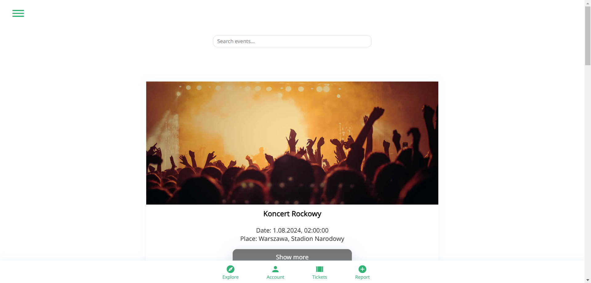

# EventNav

The app allows users to browse and search for upcoming events. The aim of the project is to provide the opportunity to find events that are less-known but may interest the users.

## Table of Contents

- [Installation](#installation)
- [Technologies](#technologies)
- [Usage](#usage)
- [Database](#database)

## Technologies

Technologies: HTML, CSS, React, Java SpringBoot, PosgreSQL

## Usage

1. Registration and Login:  
   If you want to use all features you must create an account/log in.

   
   

2. Home page:  
   You can browse events here.
   You can search for events by entering some keywords for what you are looking for.

   

3. Details of events:  
   Here is more information about event. If you are logged in, you can add events to the "Liked" tab and set the notification that will send on your email.

   

4. Liked tab:  
   Here are events you liked.

   

5. Contact:
   Here are our contact details.

   

## Database

ERD:

